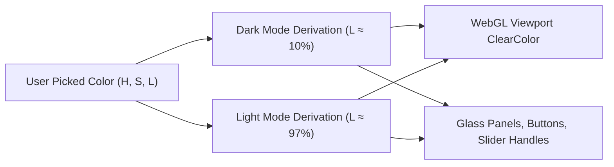

# Project Brief v12: Screen Layout Reorganization & Accent Theme System

**File:** `brief/v12_layout-reorganization-and-obsidian-accent-theme.md`  
**Target Repo:** https://github.com/pakcli/human-atlas  
**Quality Rating:** 10/10 (Production Grade Specification)

---

## 1. Executive Summary & Design Vision

**v12** reimagines the spatial architecture of the Human Atlas application:
1. **Uncluttered 3D Viewport:** Removes the bulky floating bottom dock completely.
2. **Top-Center Context Anchor:** Moves the anatomical caption (`FEMALE · REFERENCE ANATOMY` / `ADULT HUMAN · MALE`) to the top-center of the screen.
3. **Consolidated Right-Side Command Deck:** Combines camera view angles, inspection dot toggle, auto-rotation, a plain text **"Reset view"** button, and a **prominently visible Explode Anatomy Slider** into a unified right-side deck.
4. **Accent Theme Engine (Bottom-Left Inline):** Provides a dropdown menu of 5 synchronized dual-mode theme pairs plus a mathematical Custom Color Picker that styles UI chrome and WebGL viewport backgrounds while **strictly never altering the 3D anatomical mesh colors**.
5. **Clean Inline Bottom Bar:** The theme selector sits on the far left (`di paling kiri`), inline with the interaction guidance text, preventing any visual overlap.

---

## 2. Global Spatial Layout & Screen Wireframe

```
┌─────────────────────────────────────────────────────────────────────────────────────────────────────────────────┐
│ [●] INTERACTIVE ANATOMY                  FEMALE · REFERENCE ANATOMY               [ ☼/☽ ] [ 🔍 Search / ] [ ⓘ ]│
│ Human Atlas [3D]                         (Top Center Screen Aligned)                                            │
│ 888 pieces · HuBMAP HRA v1.5             Top: 28px | Left: 50% | TranslateX(-50%)                               │
│ [ ♂ Male | ♀ Female ]                                                                                           │
│                                                                                                                 │
│ ┌────────────────────────┐                                                                       ┌────────────┐ │
│ │ Systems            (15)│                                                                       │    [¾]     │ │
│ ├────────────────────────┤                                                                       │    [F]     │ │
│ │ [All] [Skeleton] [Org] │                                                                       │    [S]     │ │
│ ├────────────────────────┤                                                                       │    [B]     │ │
│ │ ● Skeleton        62[O]│                                                                       ├────────────┤ │
│ │ ● Muscles         94[O]│                                                                       │    [⊙]     │ │
│ │ ● Body surface     5[O]│                                                                       │    [↻]     │ │
│ │ ● Reproductive    12[O]│                                                                       ├────────────┤ │
│ │ ● Urinary          6[O]│                                                                       │   Reset    │ │
│ │ ● Digestive       28[O]│                                                                       │   view     │ │
│ ├────────────────────────┤                                                                       ├────────────┤ │
│ │ 888 pieces visible     │                                                                       │    45%     │ │
│ │ [Hide all]             │                                                                       │     ▲      │ │
│ └────────────────────────┘                                                                       │     │      │ │
│                                                                                                  │     ●      │ │
│                                                                                                  │     │      │ │
│                               (CENTER BOTTOM DOCK COMPLETELY REMOVED)                            │     ▼      │ │
│                                                                                                  │  EXPLODE   │ │
│                                                                                                  └────────────┘ │
│                                                                                                   Single Vertical│
│                                                                                                   Column Deck    │
│                                                                                                   Right: 24px    │
│ [● Navy / Blue ▾]   Drag to orbit · Pinch to zoom · Tap to inspect                           Source & credits ↗ │
└─────────────────────────────────────────────────────────────────────────────────────────────────────────────────┘
```

---

## 3. Element Specifications & Precision Coordinates

### 3.1. Top-Center Screen Caption
* **Position:** `position: absolute; top: 28px; left: 50%; transform: translateX(-50%); z-index: 10; pointer-events: none;`
* **Typography:** `font-size: 11px; letter-spacing: 0.16em; font-weight: 600; text-transform: uppercase;`
* **HAIRLINE Dividers:** Styled with subtle left and right 24px lines:
  ```
  ───  FEMALE · REFERENCE ANATOMY  ───
  ```
* **Dynamic States:**
  * **Assembled Default:** `FEMALE · REFERENCE ANATOMY` or `ADULT HUMAN · MALE`.
  * **Exploded Mode ($\ge 10\%$):** `ANATOMICAL INVENTORY` or `SEPARATED STRUCTURES (45%)`.
  * **Isolated Part:** `[PART NAME] · ISOLATED VIEW`.

---

### 3.2. Consolidated Right-Side View Controls (Single Vertical Column)
* **Position:** `position: absolute; right: 24px; top: 50%; transform: translateY(-50%); z-index: 30;`
* **Dimensions:** `width: 52px; border-radius: 14px; padding: 8px 5px;`
* **Layout Paradigm:** **One Single Column Alike Vertically** — a sleek vertical control strip that leaves the 3D viewport 100% open without bulky horizontal grids.
* **Styling:** Glassmorphism backdrop blur (24px blur, subtle border stroke, theme-reactive).

```
┌───────────┐
│    [¾]    │  <- 3-Quarter View Angle
│    [F]    │  <- Front View Angle
│    [S]    │  <- Side View Angle
│    [B]    │  <- Back View Angle
├───────────┤
│    [⊙]    │  <- Inspection Dots Toggle (Bare / Dots mode)
│    [↻]    │  <- Auto-Rotate Turntable Toggle
├───────────┤
│   Reset   │  <- Plain text button: "Reset view"
│   view    │
├───────────┤
│    45%    │  <- Explode separation live percentage badge
│     ▲     │
│     │     │  <- Vertical Explode Slider (100% Top, 0% Bottom)
│     ●     │
│     │     │
│     ▼     │
│  EXPLODE  │  <- Section sub-label
└───────────┘
```

#### Section Breakdown & Sequence:
1. **View Angles (`¾`, `F`, `S`, `B`):**
   * Single vertical column stack of 4 buttons (`40px × 32px`).
   * Active view angle receives primary accent pill background.
2. **Inspection Dots Toggle (`⊙`):**
   * Toggles inspection dots on/off for bare exploded view.
   * Displays active accent highlight when dots are enabled.
3. **Auto-Rotate Toggle (`↻`):**
   * Toggles slow 3D body rotation with immediate visual feedback.
4. **"Reset view" Action Button:**
   * Plain text button displaying **"Reset view"** with icon `⟲`.
   * Directly resets camera, rotation, and explosion to default assembled state.
5. **Explode Anatomy Vertical Slider:**
   * Single vertical slider (`height: 96px`, `width: 28px`) with live percentage badge (`0%` to `100%`).
   * Ergonomic, touch-friendly, and always visible on screen.

---

### 3.3. Bottom-Left Inline Accent Theme Engine & Clean Footer Bar
* **Position & Structure:** Integrated inline at the far left (`di paling kiri`) inside `.studio-footer`:
  * `left: 28px; bottom: 18px; display: flex; justify-content: space-between; align-items: center;`
  * `.footer-left`: `display: flex; align-items: center; gap: 16px; pointer-events: auto;`
  * Theme dropdown button sits first, followed directly inline by `.footer-guide` text (`Drag to orbit · Pinch to zoom · Tap to inspect`), guaranteeing **zero visual overlap**.
  * `.footer-right`: Contains `Source & credits ↗` anchored to the far right.
* **Component UI:** Compact, minimalist glass pill button with dual-mode color preview dots and an upward chevron.

```
┌────────────────────────────────────────────────────────────────────────────────────────┐
│ [● Navy / Blue ▾]   Drag to orbit · Pinch to zoom · Tap to inspect  Source & credits ↗ │
└────────────────────────────────────────────────────────────────────────────────────────┘
```

#### Dual-Mode Synchronized Color Palette Table:
Every theme option automatically syncs with the top-right **Dark/Light Mode toggle**:

| Theme ID | Preset Name | Dark Mode Palette | Light Mode Palette | Accent Color |
| :--- | :--- | :--- | :--- | :--- |
| `darkgray_lightgray` **(Default)** | **Darkgray / Lightgray** | Bg: `#181b1f`<br>Card: `#20252b`<br>Canvas: `#1a1d21` | Bg: `#f3f4f4`<br>Card: `#ffffff`<br>Canvas: `#f2f3f3` | `#38bdf8` (Cyan Blue) |
| `navy_blue` | **Navy / Blue** | Bg: `#0d1726`<br>Card: `#142236`<br>Canvas: `#0d1624` | Bg: `#f0f5fc`<br>Card: `#ffffff`<br>Canvas: `#eef4fb` | `#3b82f6` (Royal Blue) |
| `brown_cream` | **Brown / Cream** | Bg: `#1c1714`<br>Card: `#28211d`<br>Canvas: `#1a1613` | Bg: `#faf6f0`<br>Card: `#ffffff`<br>Canvas: `#f8f3ec` | `#d97706` (Amber Ochre) |
| `red_pink` | **Red / Pink** | Bg: `#201214`<br>Card: `#2c191c`<br>Canvas: `#1e1113` | Bg: `#fff1f2`<br>Card: `#ffffff`<br>Canvas: `#fef0f2` | `#f43f5e` (Rose Coral) |
| `greendark_greenlight` | **Green Dark / Green Light** | Bg: `#0f1c16`<br>Card: `#162820`<br>Canvas: `#0e1b15` | Bg: `#f0fdf4`<br>Card: `#ffffff`<br>Canvas: `#eefcf2` | `#10b981` (Emerald) |
| `custom` | **Custom Accent** | Algorithmic Dark | Algorithmic Light | User Picked Hex |

---

## 4. Algorithmic Custom Color Derivation Formula

When `Custom` is chosen from the dropdown, the user picks a single seed color $C = (H, S, L)$ via an inline color picker. The system dynamically computes the entire theme palette according to the following mathematical formulas:



### Mathematical Formulas:
1. **Light Mode Formulas:**
   $$\text{Background} = \text{hsl}(H,\ \min(S,\ 18\%),\ 96.5\%)$$
   $$\text{Glass Card} = \text{hsla}(H,\ \min(S,\ 14\%),\ 99.5\%,\ 0.88)$$
   $$\text{Border Stroke} = \text{hsla}(H,\ \min(S,\ 25\%),\ 20\%,\ 0.12)$$
   $$\text{Accent Element} = \text{hsl}(H,\ \max(S,\ 70\%),\ \max(35\%,\ \min(L,\ 48\%)))$$

2. **Dark Mode Formulas:**
   $$\text{Background} = \text{hsl}(H,\ \min(S,\ 20\%),\ 9.5\%)$$
   $$\text{Glass Card} = \text{hsla}(H,\ \min(S,\ 18\%),\ 14.5\%,\ 0.88)$$
   $$\text{Border Stroke} = \text{hsla}(H,\ \min(S,\ 20\%),\ 90\%,\ 0.10)$$
   $$\text{Accent Element} = \text{hsl}(H,\ \max(S,\ 75\%),\ \max(55\%,\ \min(L,\ 65\%)))$$

3. **WCAG Contrast Guarantee:**
   The formulas clamp lightness $L$ so that text-to-background contrast ratio is guaranteed to exceed **7.0:1 (WCAG AAA)** in both modes.

4. **STRICT INVARIANT: Mesh Colors Are Protected:**
   $$\text{MeshMaterial}.\text{color} \equiv \text{AnatomicalConstants}$$
   The accent theme engine applies exclusively to UI chrome, background canvas clear color, and slider handles. 3D anatomical organ colors (bones, arteries, veins, muscles, liver, heart, and cross-section textures) are **never** tinted or modified.

---

## 5. Responsive Behavior (< 768px & Landscape)

* **Mobile View (< 768px):**
  * The right-side command deck collapses into a compact floating action dock along the bottom right.
  * The top-center caption reduces font size to `9px` and sits just below the top status bar.
  * The bottom-left accent picker collapses into an icon button (`🎨`) that opens a modal drawer.
* **Landscape Mobile (< 600px Height):**
  * Right-side panel buttons render in a horizontal grid.
  * Caption aligns compactly at the top without overlapping headers.

---

## 6. Implementation Sequence

1. **[app/anatomy.ts](file:///d:/0pro/human-atlas/app/anatomy.ts):**
   - Extend `SceneState` with `accentTheme: AccentThemeId` and `customAccentColor?: string`.
2. **[app/globals.css](file:///d:/0pro/human-atlas/app/globals.css):**
   - Define CSS custom properties for all 5 preset pairs and custom color overrides.
   - Style the right-side consolidated control panel and bottom-left accent selector.
   - Remove bottom dock styles (`.bottom-dock`).
3. **[app/page.tsx](file:///d:/0pro/human-atlas/app/page.tsx):**
   - Relocate caption to top-center.
   - Implement the right-side control deck containing View Angles, Dots Toggle, Auto-rotate, Explode Slider, and "Reset view".
   - Implement the bottom-left inline Accent Theme picker.
4. **[app/scene.tsx](file:///d:/0pro/human-atlas/app/scene.tsx):**
   - Bind WebGL canvas clear color and platform/ground colors to the active theme palette.
5. **Quality Verification:**
   - Run `npm run check` and `npm run build`.
   - Test in browser across light/dark modes and all accent presets.
