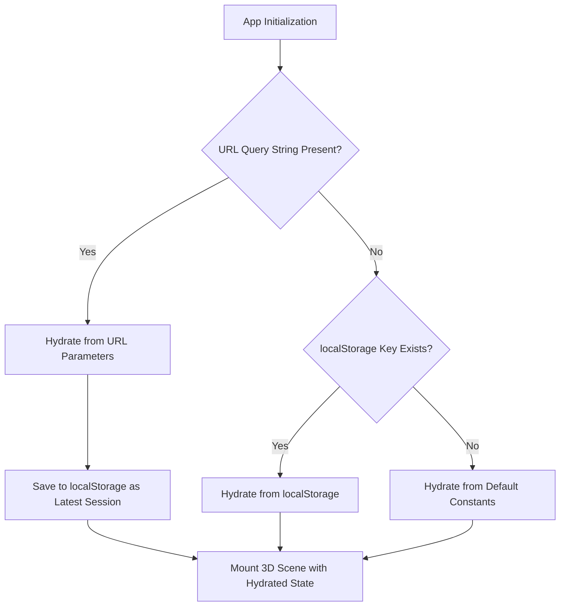

# Project Brief v14: URL State Serialization, Deep-Linking & Persistent Session Storage

**File:** `brief/v14_url-state-serialization-and-persistent-share.md`  
**Target Repository:** https://github.com/pakcli/human-atlas  
**Status:** Architecture Specification & Implementation Plan  
**Quality Rating Target:** 10/10 (Production Grade Deep-Linking Specification)

---

## 1. Objective & User Story

### 1.1 The User's Need
1. **Persistent State on Reload (`onload`):** When a user customizes their view (e.g. toggles specific anatomical systems, adjusts skin transparency, selects female sex, sets explode to 45%, orbits camera, picks Obsidian Gold theme), their session must persist across browser refreshes via `localStorage`.
2. **Deep-Link Share via URL:** Users need a dedicated **"Share" / "Save View"** button in the top actions bar. Clicking it captures the complete 3D viewport state into a shareable URL, copies it to the clipboard, and displays an immediate feedback toast.
3. **Exact Viewport Reproduction on Open:** When a colleague, medical student, or researcher opens the shared link on desktop or mobile, the application reconstructs the exact state:
   - Anatomy Reference Sex (`male` | `female`)
   - Visible Systems & Opacity Levels
   - Camera Position & Orbit Target $(\vec{p}_{\text{cam}}, \vec{t}_{\text{target}})$
   - View Preset & Explode Slider Value
   - Focused / Isolated Anatomical Structure (if selected)
   - Accent Color Theme & Dark/Light Mode

---

## 2. URL Schema Analysis & Recommendation (WDYT?)

### 2.1 The User's Proposed Concept
The user proposed:
```
domain.com?sex=male!!scope=settingsistemshow!view=position!rotation!and explode value!a=id object yang sedang di focus
```

### 2.2 Architectural Delimiter Strategy & User Design
* **Query Separator:** Use standard RFC 3986 `&` and `=` query parameters so all messaging platforms (WhatsApp, Slack, Discord, Telegram, Twitter/X) auto-detect the link without truncating.
* **Majority Delta Encoding (The User's Optimization):**
  Instead of listing every active system, dynamically compare visible count vs total universe ($N = 14$):
  - **Exclusion Mode (`-`):** When the majority of systems are visible (e.g. 11 ON, 3 OFF), serialize only the 3 excluded ones:
    `scope=-digestive-urinary-endocrine`
    *(Starts with all systems active, subtracts the listed ones)*
  - **Inclusion Mode (`+`):** When the majority of systems are hidden (e.g. only 2 ON, 12 OFF), serialize only the 2 included ones:
    `scope=+skeletal+muscular`
    *(Starts empty, adds the listed ones)*
  - **All / None Defaults:** `scope=all` (or omit for clean URL), `scope=none`.

### 2.3 Production URL Parameter Schema

| Parameter | Type / Format | Example | Description |
| :--- | :--- | :--- | :--- |
| `sex` | `male` \| `female` | `sex=female` | Reference anatomy dataset |
| `scope` | Majority Delta (`+sys` or `-sys`) | `scope=-digestive-urinary` | Visible systems via delta encoding |
| `op` | Comma-separated `id:val` | `op=integumentary:0.23` | Customized layer opacity overrides |
| `exp` | Number `0.00` – `1.00` | `exp=0.45` | Explode progression slider value |
| `cam` | `x,y,z` (2 decimal places) | `cam=1.42,1.15,3.20` | Camera 3D world position coordinates |
| `tgt` | `x,y,z` (2 decimal places) | `tgt=0.00,0.86,0.00` | Orbit target center of inspection |
| `view` | `3/4` \| `front` \| `side` \| `back` | `view=3/4` | Active cardinal viewing angle preset |
| `a` / `focus` | String (Part ID) | `a=VH_F_vagina` | Selected & focused anatomical organ ID |
| `iso` | `1` \| `0` | `iso=1` | Isolated structure mode |
| `theme` | `AccentThemeId` | `theme=obsidian_gold` | Studio accent color palette |
| `mode` | `dark` \| `light` | `mode=dark` | Light/Dark appearance mode |

#### Real-World Example (Ultra-Compact):
```
https://domain.com/?sex=female&scope=-digestive-urinary-endocrine&exp=0.35&cam=0.85,1.12,2.40&tgt=0.00,0.85,0.00&a=VH_F_vagina&iso=1&theme=obsidian_gold&mode=dark
```

> [!TIP]
> **Graceful Parser:** The parser accepts both `a=` and `focus=`, and both `-sys1-sys2` and comma-separated formats.

---

### 2.4 Majority Delta Algorithm Implementation

```typescript
// Serialization (Encoder)
export function encodeScope(visible: SystemId[], all: SystemId[]): string {
  if (visible.length === all.length) return ''; // Default: all visible
  if (visible.length === 0) return 'none';
  
  const visibleSet = new Set(visible);
  const hidden = all.filter(s => !visibleSet.has(s));
  
  if (visible.length >= all.length / 2) {
    // Majority are visible -> serialize excluded with '-'
    return '-' + hidden.join('-');
  } else {
    // Majority are hidden -> serialize included with '+'
    return '+' + visible.join('+');
  }
}

// Deserialization (Decoder)
export function decodeScope(scopeStr: string, all: SystemId[]): SystemId[] {
  if (!scopeStr || scopeStr === 'all') return [...all];
  if (scopeStr === 'none') return [];
  
  if (scopeStr.startsWith('-')) {
    const excluded = new Set(scopeStr.slice(1).split('-'));
    return all.filter(s => !excluded.has(s));
  }
  if (scopeStr.startsWith('+')) {
    const included = new Set(scopeStr.slice(1).split('+'));
    return all.filter(s => included.has(s));
  }
  
  // Fallback comma-separated
  const tokens = new Set(scopeStr.split(','));
  return all.filter(s => tokens.has(s));
}
```

---

## 3. Storage Precedence & Hydration Lifecycle

When the app boots (`onload`), state hydration follows a strict priority cascade:



1. **Priority 1 (URL Parameters):** If URL contains query parameters (shared link), it takes absolute precedence. It immediately overrides local settings and updates `localStorage` with the shared configuration.
2. **Priority 2 (LocalStorage Persistence):** If visiting directly without query parameters (`/`), the app restores the user's previous session from `localStorage['human_atlas_saved_state']`.
3. **Priority 3 (Clean Defaults):** If first visit, use `DEFAULT_VISIBLE`, `DEFAULT_OPACITIES`, sex `'male'`, explode `0`, theme `'navy_blue'`.

---

## 4. UI / UX Design: Top Action Bar "Share" Button

### 4.1 Placement & Hierarchy
In the top-right actions dock (`.top-actions`), alongside Search and About:
```
[ 🔍 Search ]  [ 🔗 Share ]  [ 🌓 Dark ]  [ ℹ About ]
```

### 4.2 Interactive States
1. **Default State:**
   - Button with icon `<Share2 size={15}/>` or `<Link size={15}/>` and text label `"Share"`.
   - Sleek glass surface matching top actions.
2. **Click Interaction:**
   - Reads active camera coordinates from `controls.object.position` and `controls.target`.
   - Serializes current state into URL query string.
   - Pushes clean URL to browser history via `window.history.replaceState`.
   - Copies full URL to clipboard using `navigator.clipboard.writeText`.
   - Triggers transient button state: `<Check size={15}/>` + `"Copied!"` for 2 seconds.
   - Optional toast badge at top center: `"Snapshot link copied to clipboard!"`.

---

## 5. Technical Implementation Details

### 5.1 New State Serializer Helper (`app/url-state.ts`)
A dedicated, zero-dependency serialization module:
* `serializeSceneState(state, sex, theme, cameraPos, cameraTarget)`: Generates query string.
* `deserializeSceneState(searchParams)`: Parses query string into structured state object.
* `saveLocalSession(state, sex, theme)`: Writes debounced JSON to `localStorage`.
* `loadLocalSession()`: Safely reads and validates `localStorage`.

### 5.2 Synchronizing Camera Coordinates from Three.js to React
* Currently, camera position and target live inside Three.js `OrbitControls` inside `app/scene.tsx`.
* To capture exact camera orientation during share:
  - Expose a lightweight ref or custom event `atlas-get-camera`:
    ```ts
    window.addEventListener('atlas-request-camera-state', () => {
      window.dispatchEvent(new CustomEvent('atlas-response-camera-state', {
        detail: {
          cam: [camera.position.x, camera.position.y, camera.position.z],
          target: [controls.target.x, controls.target.y, controls.target.z]
        }
      }));
    });
    ```
  - Or maintain active coordinates via debounced camera change listener.

### 5.3 Auto-Save to LocalStorage
* Whenever `state`, `sex`, or `theme` changes, a debounced (500ms) effect saves the state to `localStorage.setItem('human_atlas_saved_state', JSON.stringify(...))`.
* Camera position is saved on `controls.change` end.

---

## 6. Edge Cases & Resilience Safeguards

1. **Invalid / Unknown Organ ID in `focus`:**
   If `focus=unknown_id` is passed, the parser gracefully ignores it and falls back to unselected anatomy without throwing or crashing.
2. **Missing or Corrupted Query Parameters:**
   All deserialized fields are validated against strict types (`SystemId`, `AccentThemeId`, number ranges). If any field is NaN or corrupt, the default fallback is safely applied.
3. **Clipboard API Permissions:**
   If `navigator.clipboard.writeText` is blocked (e.g. non-HTTPS iframe), provide a fallback `prompt()` or modal input with pre-selected text so the user can copy manually.
4. **Camera Coordinate Clamping:**
   Clamp camera distances between `minDistance (0.07)` and `maxDistance (40)` so malicious or extreme coordinates do not send the camera into infinity.

---

## 7. Inviolable Regression Protection Checklist

- [ ] **Anatomical Vertex Colors Untouched:** Zero changes to `SYSTEMS` colors or shaders.
- [ ] **Single-Column Vertical Command Deck Maintained:** Right vertical deck remains intact.
- [ ] **Source & Credits Location Preserved:** Remains cleanly seated below Gender selector on left.
- [ ] **Bottom-Right Theme & Guide Preserved:** Theme selector and guide text stay anchored at bottom-right.
- [ ] **Left Systems Panel Full-Height Preserved:** Continues to touch bottom of screen (`bottom: 16px`).
- [ ] **Solid Plain Studio Aesthetic Preserved:** Canvas remains solid plain background with circular podium.
- [ ] **Zero Linter or Type Errors:** Verified via `npm run check` and `npm run build`.
